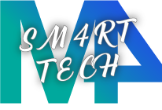

# SM4rtTech

¡Somos el grupo 13!
Nuestro marketplace SM4rtTech es un e-commerce abocado a la venta de equipos tecnológicos, con proyección a ampliar la variedad de productos.

La audiencia objetivo será el publico general que se encuentre en la búsqueda de productos en el ámbito de la tecnología.

Brindamos un asesoramiento de excelencia, ofreciendo una amplia variedad, con la mejor relación calidad/precio. Es nuestro objetivo darles la mejor experiencia de compra, estando en una constante mejora de procesos e ideas, ofreciendo lo mejor de nosotros.

## Integrantes
___

### María del Carmen Martínez 

- 41 años  
- Empleada administrativa  
- Estudiante de programación

### Mercedes Reynaga
- 33 años
- Atención al cliente/cajera
- Estudiante de programación

### Manuel Salvador
- 22 años
- Administrador de página web
- Estudiante de programación

### Matias Galeano
- 24 años
- Jugador de voley
- Estudiante de programación

## Sitios de referencia
___

- Estética y funcionalidad
    - [Mercado Libre](https://www.mercadolibre.com.ar/)
    - [Frávega]()
___
- Estética
    - [Compumundo]()
    - [Musimundo]()
___
- Estética y organización
    - [Facebook]()
___
- Estética y clientes a los que apunta
    - [Samsung]()
    - [Sony]()
___

